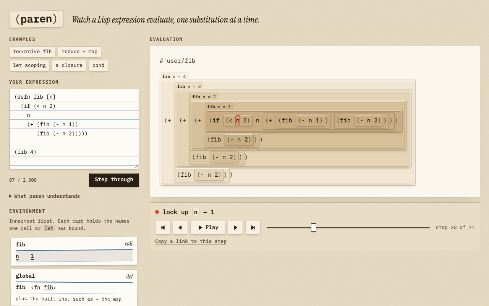

# paren

**Watch a Lisp expression evaluate, one substitution at a time.**

**Live:** https://paren-23l.pages.dev

paren is a stepper for a small teaching subset of Clojure. Paste an expression (or pick one of five examples) and step through its evaluation. Each sub-expression is a paper card, stacked on the one that contains it; deeper cards are darker and sit higher, with longer shadows. The part about to reduce (the *redex*) is washed in vermilion, with a folded corner, or becomes a vermilion chip when it is a single name. When you step, it folds shut into its value. The environment sits beside the stage as a stack of index cards, and every step has a one-line caption such as ``look up `n` → 3``.



## The 30-second experience

1. Open the page. The recursive `fib` example is loaded at step 0.
2. Press → (or the step button). `(fib 4)` becomes the body of `fib` on a card tabbed **fib n = 4**. `n` is looked up (`look up n → 4`), `(< 4 2)` becomes `false`, the `if` takes its else-branch, and so on.
3. Scrub the slider to jump anywhere. ← steps back, Home and End jump to either end, and Play steps on its own.
4. Try **a closure**: when `add5` runs, the environment shows the `make-adder` card, marked *kept by a closure*, still holding `n = 5` after `make-adder` has returned.
5. Copy the link. It encodes the expression and the current step, so it opens the same moment for someone else.

The examples are recursive `fib`, `(reduce + (map inc [1 2 3]))`, `let` scoping, a closure, and `cond`.

## How it works

Everything that matters is ClojureScript under `src/paren/`.

- **Reading.** `reader.cljs` uses `cljs.tools.reader`, the real Clojure reader ported to ClojureScript, to turn the text into Clojure data: lists, vectors, maps, symbols. Code is data from here on. Input is capped at 2,000 characters.
- **Checking the subset.** `syntax.cljs` walks that data and builds an expression tree. Anything outside the subset is refused before a single step runs, with a message that names it. Examples: ``loop` isn't in paren's teaching subset (write it as plain recursion instead)``, ``Destructuring ([a b]) in `let` isn't in paren's teaching subset``, ``Java/JavaScript interop (`.toUpperCase`) isn't in paren's teaching subset``, and syntax-quote (the backtick). Malformed special forms get their own messages, such as ``let` bindings come in pairs``.
- **Stepping.** `stepper.cljs` is a small-step evaluator.
  - Each step finds the redex in Clojure's order: arguments left to right, innermost first. An operator that is itself an expression, as in `((fn [x] x) 1)`, is evaluated before them. A named function such as `fib` is looked up when the call happens (see [Honest limitations](#honest-limitations) for why that gives Clojure's results).
  - It replaces the redex with what it reduces to: a value, the chosen branch of an `if`, or a function body.
  - A function call becomes a `:scope` node that holds the call's bindings and the closure's captured environment. Lookups walk that chain of frames, then the globals made by `def`, then the built-ins.
  - `map`, `filter` and `reduce` unfold into the calls they will make, so a user function passed to `map` shows every call as its own steps.
  - Each step returns a caption, the redex's path, the environment at that point, and (for lookups) which frame answered.
- **Tracing.** `trace` runs the whole program once and keeps every state. Clojure's persistent data structures share structure between states, so keeping thousands of snapshots is cheap, and stepping back or scrubbing is just indexing.
- **Drawing.** `layout.cljs` turns a tree into cards and decides line breaks like a Clojure pretty-printer. A card stays on one line if it fits the stage width (measured in `ch`); otherwise it breaks the way Clojure is usually indented. `cond` pairs always get a line each. `app.cljs` renders that with plain DOM calls (no framework, to keep the bundle small) and runs the fold animation with the Web Animations API. From 1,180 px wide, the page has three columns (source, stage, environment), so the stage, its caption and the environment are in view together.

### The subset

| | |
|---|---|
| Data | numbers, strings, keywords, `nil`, `true`/`false`, vectors, maps, quoted lists (`'(1 2 3)`) |
| Special forms | `def` `defn` (at the top level) `fn` `let` `if` `cond` `do` `and` `or` `quote`, plus `#(…)` short functions |
| Built-ins | `+ - * / inc dec mod rem quot max min = not= < > <= >= zero? pos? neg? even? odd? nil? not empty? count first rest cons conj get assoc nth vector list range str map filter reduce` |
| Also | recursion, closures, rest parameters (`[x & more]`), keywords, maps and vectors used as functions |

Semantics follow ClojureScript: numbers are JavaScript numbers, so `(/ 1 3)` is `0.3333333333333333` and `(/ 1 0)` is `##Inf`.

### Caps, each with its own message

- 2,000 characters of input, nested at most 50 brackets deep, and at most 100 levels once quote marks such as `'` and `~` are counted (`'x` reads as `(quote x)`, a level with no bracket).
- 5,000 steps. The steps up to the cap stay scrubbable.
- 100 function calls in progress at once (the recursion cap).
- 2,500 boxes on the stage, nested at most 400 boxes deep. Drawing the stage walks the tree recursively, and a recursive call sitting inside many pending calls deepens it fast; far past this the browser runs out of stack.
- 10,000 items in any one value, counting everything nested inside it. Doubling a vector 40 times shares structure, so it costs almost no memory, but comparing two such values would walk 2^40 items. The cap stops the program at the step that would build the value.
- `str` results up to 10,000 characters, and `range` up to 1,000 numbers. `range` only takes finite numbers.

A share link runs its expression as the page loads, so these caps also keep a crafted link from hanging a visitor's tab. The browser test opens such links and checks that each one stops within a few seconds with its message.

## Why ClojureScript

The stepper *is* the thing the language is good at:

- The input is read by the language's own reader, and the evaluator pattern-matches on the same lists and vectors a Clojure programmer writes.
- Immutable, structurally shared data makes "keep every state of the evaluation" a design choice rather than a memory problem.
- The Closure Compiler's `:advanced` mode keeps the result small enough for a static page.

## Build

Needs **Node 22+** and **Java 21+**. shadow-cljs compiles ClojureScript on the JVM, and it downloads ClojureScript itself from Maven Central/Clojars on the first build.

```sh
npm ci
npm run build        # shadow-cljs release (:advanced) → dist/
npm run serve        # optional: serve dist/ on a random free port
```

`scripts/postbuild.mjs` assembles `dist/`. It copies the content-hashed bundle, hashes the font files and points the stylesheet at them, hashes the stylesheet, fills in `index.html`, writes `_headers` and `THIRD-PARTY-NOTICES.txt` (see [Licence](#license)), and prints the sizes, measured at build time. From the latest build:

| file | raw | gzip |
|---|---|---|
| `js/main.<hash>.js` (everything: reader, evaluator, UI, cljs.core) | 289.9 KiB | 70.4 KiB |
| `css/styles.<hash>.css` | 22.2 KiB | 6.1 KiB |
| `index.html` | 5.7 KiB | 2.0 KiB |
| `fonts/*.<hash>.woff2` (six files, fetched as the page uses them) | 101.1 KiB | (already compressed) |

About 65% of the bundle (by optimised size) is `cljs.core` itself; the code, styles and page together are 78.5 KiB gzipped. The fonts, IBM Plex Mono and Instrument Serif, are served from the site itself (see [Privacy](#privacy)).

## Test

```sh
npm test
```

This runs three things:

1. **ClojureScript tests** (`shadow-cljs` `:node-test`, `test/paren/`), 57 tests with 831 assertions:
   - the stepper on each supported form, with its exact captions and values, including lookup steps for shadowed built-ins and `Duplicate key` for computed map keys;
   - **golden caption sequences** for all five examples, every step in order, plus their final values;
   - the step cap, the recursion cap, the size cap, the nesting cap (the deepest step must still lay out), the value cap (the doubling program above must stop in under 2 seconds), and the `str`/`range` caps, including `NaN` and a step too small to move;
   - speed: a 2,000-character program with 300 built-in names inside a 250-name `let` must reach the step cap within 3 seconds;
   - `range` matching ClojureScript's own, number for number;
   - an exact message for each unsupported form (including interop and a nested `def`) and each malformed special form;
   - the reader error path (unbalanced input, EOF, oversized, over-nested and empty input, syntax-quote), with the position given once;
   - layout: line breaking, the redex always present in the display tree (also on the step that fails), and the environment cards;
   - 71 odd or hostile inputs, each of which must end in a clear status within 3 seconds and never an internal error.
2. **The build.**
3. **Node tests** (`tests/`):
   - a `dist/` smoke test: hashed files, the self-hosted fonts (no Google Fonts reference in the page, stylesheet or headers; six hashed WOFF2 files, each used by the stylesheet), the third-party notices, `_headers`, a 100 KiB gzip budget, and serving with the production headers;
   - a **headless Chrome** check over the DevTools protocol, run against `dist/` with the production Content-Security-Policy. It steps, scrubs, plays, opens shared links and feeds in bad input. It opens hostile share links, which must settle within 5 seconds with their message, and links with a malformed step such as `s=abc`, which must open at a real step. It checks for no horizontal scroll at a true 400 px width (device emulation) on every step of `fib` and with very long names, strings and error messages, WCAG AA contrast in light and dark (including text on the vermilion redex, as a chip and as a washed card), and instant steps under `prefers-reduced-motion`. It checks that each of the six font faces loads and that no request leaves the page's origin, and it fails on any console error, exception or CSP violation.

If Chrome isn't found, the browser tests are skipped. `REQUIRE_BROWSER=1` makes that a failure, and `CHROME_PATH` points at a specific browser.

## Cloudflare (free tier, static only)

`dist/` is twelve static files (six of them fonts). There is no Worker, KV, D1 or server code, and no API calls. That is far inside Cloudflare Pages' free static limits: unlimited requests, 20,000 files per site, 25 MiB per file.

It is live at <https://paren-23l.pages.dev>. To deploy your own copy:

```sh
npm run build
npx wrangler pages deploy dist --project-name paren
```

There is deliberately no `npm run deploy` script and no `account_id` in `wrangler.toml`. The plain command above uses whatever Cloudflare login is active, which is fine for your own copy. The owner deploys this project through a separate, guarded script that checks which account it is about to use.

`dist/_headers` sets:

- a strict Content-Security-Policy: `script-src 'self'`, `style-src 'self'` and `font-src 'self'`, and no inline scripts or styles;
- `nosniff`, `no-referrer`, and a locked-down Permissions-Policy;
- a one-year immutable cache **only** on `/js/*`, `/css/*` and `/fonts/*`, whose file names carry a content hash. `index.html` is `no-cache`.

## Privacy

- Everything runs in the browser. There are no analytics, no cookies and no storage.
- The expression lives in the URL fragment (`#e=…&s=…`), which browsers do not send to the server.
- The page makes no third-party requests. The fonts are served from the site itself, not from a font service, and the Content-Security-Policy allows scripts, styles and fonts from the site only.

## Honest limitations

- **It is a subset, not Clojure.** There are no macros, lazy sequences, destructuring, `loop`/`recur`, sets, multi-arity functions, atoms, printing or Java/JavaScript interop, and `def`/`defn` only work at the top level. Each is refused by name rather than half-supported.
- **`map`, `filter` and `reduce` are eager.** Every call they make becomes a visible step. Clojure's `map` and `filter` are lazy (and chunked), so an infinite sequence that works in Clojure cannot work here. `range` is capped at 1,000 numbers for the same reason.
- **Some steps are folded together, on purpose.**
  - A built-in such as `+` in call position isn't a separate "look up" step. If a local or `def` has taken over a built-in's name, as in `(let [inc dec] (inc 5))`, that name gets a lookup step like any other.
  - A named function (`fib`) in call position is looked up when the call happens, after its arguments; Clojure looks it up first. The result is the same because nothing can rebind the name in between: locals never change, and `def`/`defn` only work at the top level. That is why a nested `def`, as in `(def g dec) (g (do (def g inc) 1))`, is refused: in Clojure it gives 0, and an evaluator that looks `g` up late would give 2. An unknown name still fails before the arguments run, as in Clojure.
  - `defn` takes one step, not a macro expansion into `def` + `fn`.
- **Numbers are JavaScript numbers** (ClojureScript semantics). There are no ratios or big integers, and division by zero gives `##Inf` instead of throwing as JVM Clojure does.
- **Printing differs from a REPL.** A function prints as `‹fn fib›` or `‹fn [x]›`, where a REPL would print an opaque object.
- **The whole trace is computed when you press Step through**, on the main thread, up to the 5,000-step cap. Long traces take a moment. No timing is claimed.
- **Layout is estimated in `ch`.** Very deep nesting can make the stage scroll sideways inside its own frame; the page itself does not scroll sideways.
- **Contrast is checked by the automated test** at two steps of `fib` in each theme (one where the redex is a name, one where it is a whole card), not for every possible program.

## Next

- A cross-check of final values against the self-hosted ClojureScript compiler (`cljs.js`), lazy-loaded because it is several MB.
- Macros, with macro expansion shown as its own step (`when`, `->`, `defn` → `def` + `fn`).
- Lazy sequences (`lazy-seq`, lazy `map`/`filter`, `take`, `iterate`) with realisation shown as steps.
- Destructuring in `let` and `fn` beyond single names.
- `loop`/`recur` drawn without growing the stack, and a "collapse finished frames" view for deep recursion.
- A coarser step mode that hides lookups, for longer programs.

## Credits

Built by Ramen Protocol with AI assistance (Claude). Typography: IBM Plex Mono and Instrument Serif, both under the SIL Open Font License 1.1 and served from this site (their notices are in `THIRD-PARTY-NOTICES.txt`).

## License

paren's own code is MIT. See [LICENSE](LICENSE).

The compiled bundle also contains third-party code: ClojureScript (`cljs.core`, `clojure.string`, `clojure.walk`), `cljs.tools.reader` and a few lines of shadow-cljs module runtime, all under the Eclipse Public License 1.0, and parts of the Google Closure Library, under Apache-2.0. `:advanced` compilation strips their source headers, so the build writes `dist/THIRD-PARTY-NOTICES.txt` with each component's version (read from what the build resolved), copyright, licence, source address, the EPL-1.0 object-code terms, and the full EPL-1.0 and Apache-2.0 texts (kept in `licenses/`). The page's footer links to it, and the bundle starts with a short `/*! … */` banner pointing there. The build fails if the bundle ever contains a source file that the notices don't cover.

The site also ships its two typefaces, both under the SIL Open Font License 1.1: IBM Plex Mono (IBM's own Latin1 WOFF2 subsets from `@ibm/plex-mono` 2.5.0, unmodified, because "Plex" is a Reserved Font Name) and Instrument Serif (the Latin subset Google Fonts serves). The files are in `public/fonts/`, their licence files in `licenses/`, and `THIRD-PARTY-NOTICES.txt` lists each file with its copyright line and the OFL text. The build fails if `public/fonts/` holds a file the notices don't list.
